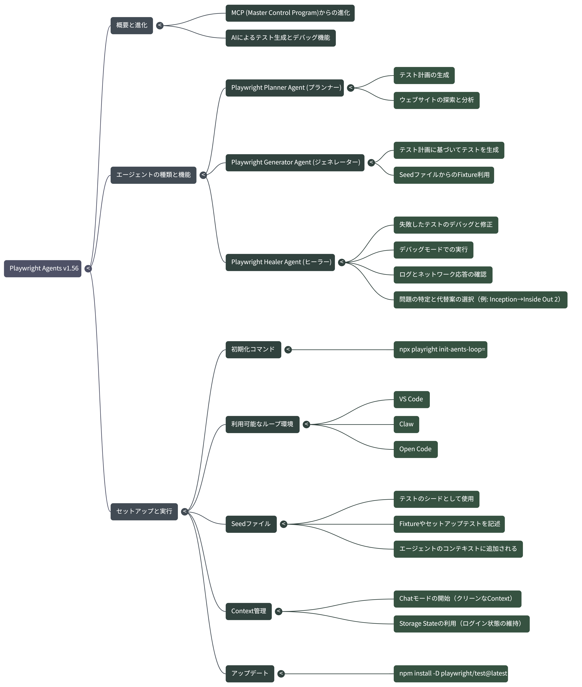

# Logs

## Preparations

```shell
# Update npm packages with force
npm update --force

# Help for initializing Playwright Agents
npx playwright init-agents

# Initialize Playwright Agents for VSCode loop mode
npx playwright init-agents --loop=vscode
```

## Basic operations

```shell
# Run the logged-in seed tests in headed mode
npx playwright test \
  --headed \
  tests/logged-in/seed.spec.ts

# Open the test report in the browser
npx playwright show-report
```

## Playwright Agents

```shell
# Start the app in dev mode
npm run dev
```

- planner: `映画のリストを管理するためのテスト計画書を作成して "movies-list-plan.gen.md" として specs ディレクトリに保存してください。テスト対象のウェブサイトは "http://localhost:3000" で動作しています`
- generator: `#file:movies-list-plan.md の "2. Adding Movies to Lists" で記述されているテストを作成してください。`
- healer: `テストを実行して修正してください`

## Mind map



## References

- [Playwright Test Agents](https://playwright.dev/docs/test-agents)
- [Playwright v1.56: From MCP to Playwright Agents](https://www.youtube.com/watch?v=_AifxZGxwuk)
- [Playwright Agents v1.56.0](https://github.com/microsoft/playwright/releases/tag/v1.56.0)
  - [prompts](https://github.com/microsoft/playwright/tree/v1.56.1/packages/playwright/src/agents)
- [Playwright tests for a Movie App](https://github.com/debs-obrien/playwright-movies-app)
